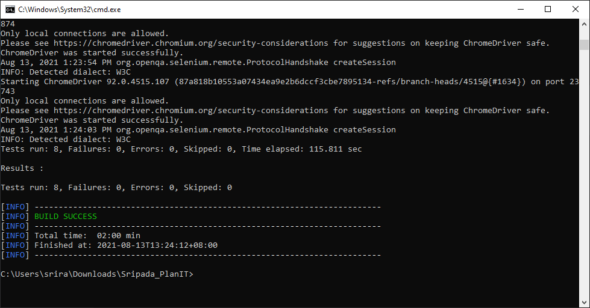

# Planit_Test - Technical Assessment

## Setup

This framework uses Maven, Selenium with Java and TestNG

Instructions to setup and verify the installation of Maven and JDK are available in the below link.
https://www.tutorialspoint.com/maven/maven_environment_setup.htm

Framework also uses chromedriver which is dependent on the version of chrome running on the machine where tests are executed.
This framework uses chromedriver compatible for Chrome version 92.0.4515.131

To find the chromedriver version compatible for the version of chrome you are using please visit https://chromedriver.storage.googleapis.com/index.html, download the corresponding API and copy the same to .\src\test\resources\ChromeDriver folder.

Framework uses page object model as the design pattern.

## Executing tests

The projects includes 4 test cases that are all included in one class 'TestCases'. All these test cases are included in the TestNG.xml file.

Project reads the application URL from the properties file located under src\test\resources.

Tests are optimised to work on both the versions of the application.

http://jupiter.cloud.planittesting.com

http://jupiter2.cloud.planittesting.com

### Running from command prompt

This can be done by creating a batch file with below 

    cd "testng.xml file location"
    
    mvn clean test

or by running the command 'mvn clean test' from the project root directory (where pom.xml is located)

BUILD SUCCESS message will be shown in the CI tool logs or in the command prompt when the test is complete.

### Reports
Below is a HTML report that will be created upon execution

${basedir}\target\surefire-reports\index.html

Below is a HTML report that can emailed to stakeholders upon execution

${basedir}\target\surefire-reports\emailable-report.html

